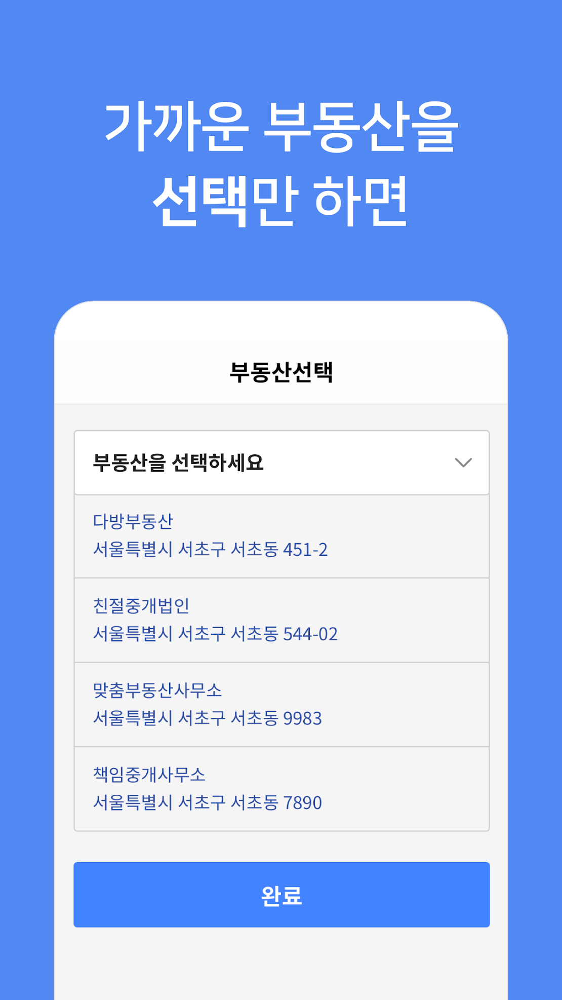

# 소개
### 류보경
* email : <ryoobk90@gmail.com>

# 경력
### 스테이션 3
* 재직기간 : 2017.05 ~ 2019.01
* 담당업무 : 부동산 중개 플랫폼 '다방' 안드로이드 앱 개발

### 프리랜서
* 프로젝트 기간 : 2017.03 ~ 2017.04
* 담당업무 : LG전자 GERP 설치품질관리사 안드로이드 앱 개발

### 프리랜서
* 프로젝트 기간 : 2016.07 ~ 2016.12
* 담당업무 : 신세계백화점 안드로이드 앱 개발 및 유지보수

### 이담정보통신
* 재직기간 : 2011.11 ~ 2015.08
* 담당업무 : 스마트워치 개발, 골프 거리 계산 앱 및 생활패턴 기록 앱 개발

# 프로젝트
### 다방 앱
오픈형 부동산 플랫폼으로 방을 찾을 수 있도록 제공하는 서비스
* 소속 : 스테이션3
* 기간 : 2017.05 ~ 2019.01
* 사용기술 : Java, Kotlin, RxJava, retrofit, glide, FCM, Android KTX, MVP Pattern
* 링크 : https://play.google.com/store/apps/details?id=kr.co.station3.dabang

   

### 다방 방주인 앱
방주인이 공실 광고를 쉽고 간편하게 할 수 있도록 제공하는 서비스
* 소속 : 스테이션3
* 기간 : 2018.08 ~ 2018.10
* 사용기술 : Kotlin, Rxjava, retrofit, FCM, Koin, MVVM Pattern
* 링크 : https://play.google.com/store/apps/details?id=kr.co.station3.dabanghouseowner

   

### Dust 앱
현재 자신의 위치와 가장 가까운 미세먼지 측정소의 정보를 보여주는 서비스, 위젯 제공
* 개인프로젝트
* 기간 : 2018.07 ~ 2018.09
* 사용기술 : Kotlin, Rxjava, retrofit, glide, Fabric Crashlytics, Firebase RemoteConfig
* 링크 : https://play.google.com/store/apps/details?id=com.ryoobk.dustdust

   

### LG GERP 설치품질관리사 앱
LG 설치품질관리사가 이미지 및 파일을 업로드할 수 있도록 제공하는 하이브리드 앱 (LG임직원용 앱)
* 소속 : 프리랜서
* 기간 : 2017.03 ~ 2017.04
* 주요기능
  - HttpUrlConnection을 이용한 서버 통신 구현
  - Javascript Bridge 연결
  - 커스텀 갤러리 및 커스텀 파일리스트 구현 및 이미지 파일 서버 전송 구현
  - Google Map을 이용한 지도 표시
  - GPS 이용한 현재위치 찾기
  - GCM을 이용한 PUSH 및 Notification 처리

### 신세계백화점 앱
신세계백화점 지점별 행사 및 쿠폰, 전자영수증 등을 확인할 수 있도록 제공하는 서비스
* 소속 : 프리랜서
* 기간 : 2016.07 ~ 2016.12
* 사용기술 : Java, GCM
* 링크 : https://play.google.com/store/apps/details?id=com.F1.ShinSG

   

### Fioti LifeStyle 앱
생활 패턴 기록 앱으로, 설치된 앱의 사용정보, 스마트밴드와 연동하여 걸음 수 및 수면정보를 타임라인에 표시해주는 서비스 (서비스 종료)
* 소속 : 이담정보통신
* 기간 : 2013.11 ~ 2015.08
* 주요기능
  - 걸음 수 및 수면 정보를 데이터화 하여 시간/일/주/월/년별 그래프로 기록
  - 연동 기기인 스마트밴드 사용자들 간의 자동 친구 등록되어 걸음수 랭킹화
  - 스마트폰에 설치된 앱 사용 정보를 데이터화 하여 시간/일/주/월/년별 그래프 및 아이콘 형태로 기록

### Watchdog Caddie 앱
골프장에서 사용하는 앱으로, 현재위치에서 홀까지의 거리를 계산해주는 서비스 (서비스 종료)
* 소속 : 이담정보통신
* 기간 : 2012.09 - 2013.11
* 주요기능
  - FTP 서버에서 골프장 위치 정보 다운로드
  - DaumMap API를 이용하여 화면 구성, 
  - GPS를 이용하여 현재 위치에서 가장 가까운 홀의 위치 및 각 홀까지 직선 거리 계산 및 표시 
  - 상기 정보를 Smart Watch로 전달
  
### Watchdog 스마트워치
스마트폰의 전화, 문자, SNS 등의 내용을 확인할 수 있도록 하는 블루투스 기기
* 소속 : 이담정보통신
* 기간 : 2011.11 ~ 2013.05
* 사용기술 : C언어

# 교육
* 자바 네트워크 개발자 양성과정 (KH정보교육원)
  - 교육기간 : 2015.11 ~ 2016.05
  - 사용기술 : Java, Oracle, Servlet, JSP, HTML5, CSS3, JavaScript, ajax, EL/JSTL, Spring, Mybatis
* Android App Programming Advanced (MDS테크놀로지)
  - 교육기간 : 2013.08
* Android App Programming Basic (MDS테크놀로지)
  - 교육기간 : 2013.07

# 자격증
* 리눅스마스터 2급 (한국정보통신진흥협회) - 2018.09
* SQLD (한국데이터베이스진흥원) - 2016.04
* 정보처리기사 (한국산업인력공단) - 2011.09
